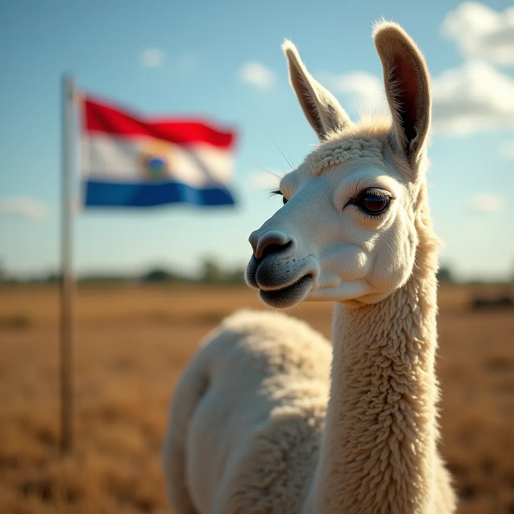

# Curate Alpaca

<div align="center">

</div>

## About

Simple tool to curate alpaca dataset for training LLMs in other language.

In this case we built this tool to curate dataset transalated to Guarani and prepare for finetunning LLMs with this new language.

## Key Features
- Use Alpaca based instruction dataset 
- Using `nllb-200-distilled-600M` to translate into the desired language (Guaraní in this case)
- Supabase for manage the dataset
- Gradio to build the UI
- HF Transformers pipeline to translate the dataset

### How to use
1. Clone the repo
```bash
git clone this repo
```

2. Install the requirements
```bash
pip install -r requirements.txt
```

3. Set env vars. 
```bash
export SUPABASE_URL=your_supabase_url
export SUPABASE_KEY=your_supabase_key
```

3. Run the app
```bash
python main.py
```

## Alpaca-Guarani Database Schema Used for this project

### Table: alpaca-guarani

This table stores original Spanish texts and their Guarani translations for the Alpaca dataset.

| Column Name           | Data Type | Constraints | Description                                    |
|-----------------------|-----------|-------------|------------------------------------------------|
| id                    | int8      | PRIMARY KEY | Unique identifier for each entry               |
| original_instruction  | text      |             | Original instruction text in Spanish           |
| original_input        | text      |             | Original input text in Spanish                 |
| original_output       | text      |             | Original output text in Spanish                |
| translated_instruction| text      |             | Translated instruction text in Guarani         |
| translated_input      | text      |             | Translated input text in Guarani               |
| translated_output     | text      |             | Translated output text in Guarani              |
| translated            | bool      |             | Flag indicating if the entry has been translated |

### Notes:
- The `id` column is used as the primary key and should be automatically incremented.
- The `translated` column is a boolean flag to easily identify which entries have been translated.
- All text fields (original and translated) are stored as `text` type to accommodate varying lengths.
- The schema follows the structure of the Alpaca dataset, with separate fields for instruction, input, and output.

### Usage:
- When inserting new entries, ensure the `id` is unique.
- Set `translated` to `false` when adding new original texts.
- Update `translated` to `true` when the translation is completed.
- Query untranslated entries with: `SELECT * FROM alpaca-guarani WHERE translated = false;`
- Query translated entries with: `SELECT * FROM alpaca-guarani WHERE translated = true;`

This schema allows for efficient storage and retrieval of both original and translated texts, facilitating the translation process and progress tracking.